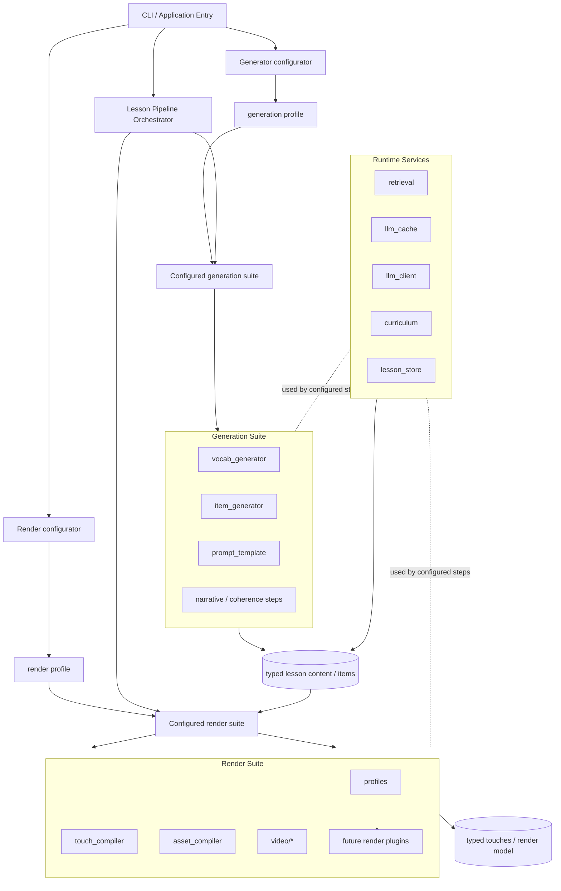
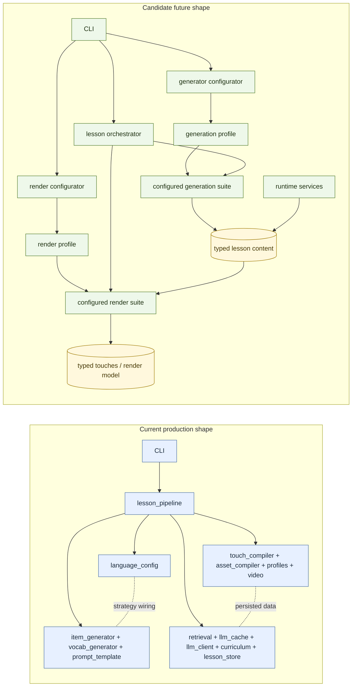
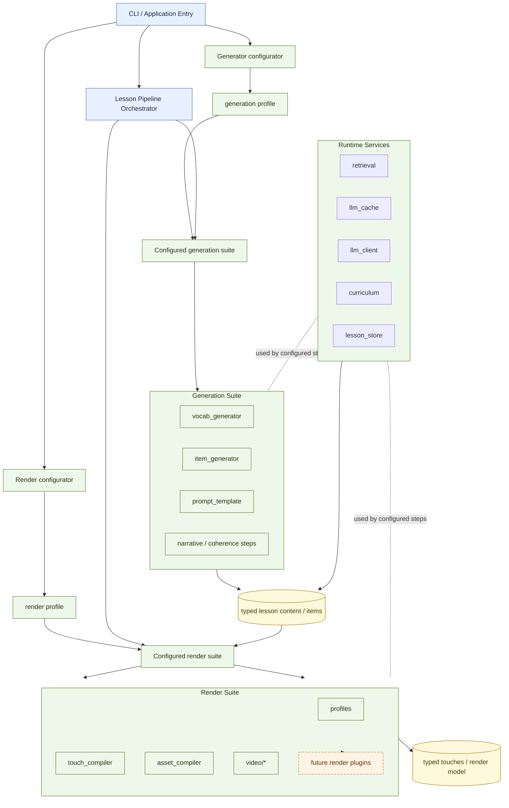
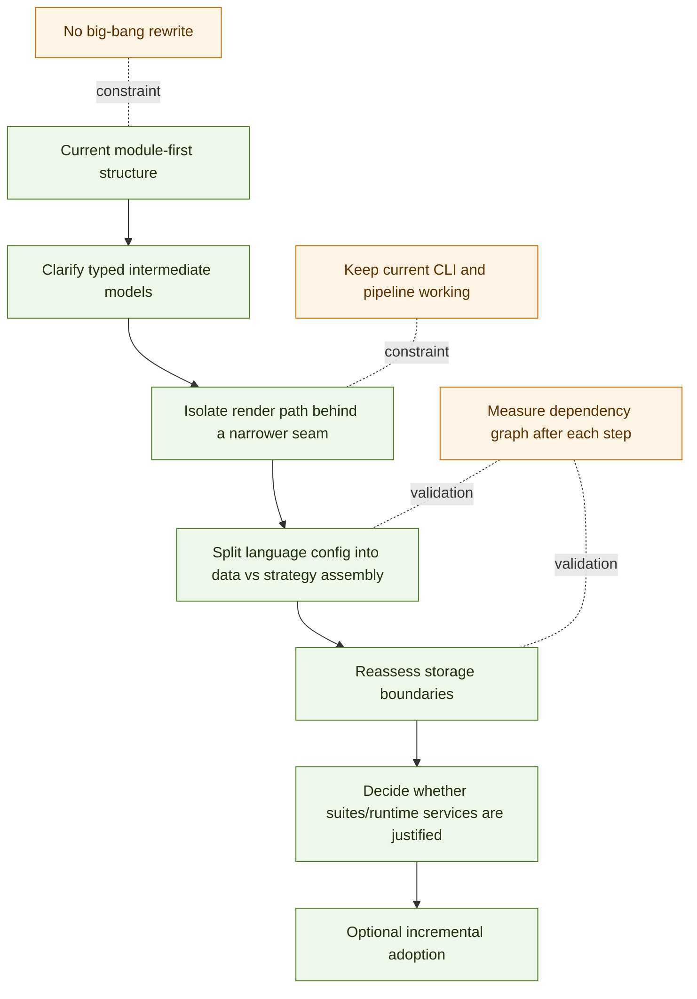

# Decision Preparation: Suite And Runtime-Service Boundaries

**Status:** Preparation only — no decision yet  
**Date:** 2026-03-21  
**Context:** Internal module dependency analysis and recent pipeline refactoring reduced the
largest dependency loop, but the codebase still shows a module-first structure with several
high-coupling areas. A candidate next architectural step is to reorganize future refactoring
around three higher-level seams: a generation suite, a render suite, and runtime services.

---

## Problem

The current production structure works, but it still leaves several architectural questions open:

1. Which modules together define lesson content generation?
2. Which modules together define rendering/compilation behavior?
3. Which modules own retrieval, persistence, and cache/client boundaries?
4. Should pipeline assembly stay module-first, or become suite/runtime-service-first?

Recent dependency analysis suggests that the system is stabilizing around a few clusters, but
the long-term ownership model is still implicit rather than documented.

This document prepares that decision. It does not make it.

---

## Candidate Concept

### Refined interpretation of the candidate

The current best interpretation of the candidate is not simply three large buckets.
It is closer to a pipeline-assembly model with explicit interfaces.

The term `engine` is probably not the best fit here. The candidate behaves more like a
profile-driven container of loosely coupled specialised steps. In this document, that concept
is now called a `suite`.

Working interpretation:

1. each suite exposes a suite interface
2. each suite has at least a configurator and a builder role
3. the CLI talks to suite configurators, not directly to low-level modules
4. the CLI passes configured suites into the orchestrator
5. the orchestrator asks those suites/builders to assemble the pipeline
6. configured pipeline steps use runtime services as needed during execution

This means runtime services are mainly runtime dependencies of pipeline steps,
not the primary thing the CLI coordinates directly.

Each suite would also have its own profile model that controls step configuration and the
resulting step list, or step graph where dependencies matter.

Example: narrative lesson generation

1. generate a narrative frame
2. generate sentences that adhere to grammar progression and the narrative
3. run a review/coherence step over those generated sentences

That is not just a flat list of unrelated generators. It is a dependency-aware flow where one
generated artifact becomes input and constraint for later steps.

Possible interface roles under this interpretation:

| Candidate role | Intent |
|----------------|--------|
| `Suite interface` | stable top-level capability contract for a specialised step container |
| `Configurator` | translate CLI/runtime options into a suite-specific configured object |
| `Builder` | produce configured pipeline steps or execution-ready components |
| `Profile` | define step configuration and the intended step list or step graph for the suite |
| `Orchestrator` | receive configured suites, assemble the final pipeline, and execute it |
| `Runtime services` | supply retrieval, persistence, cache, and state access to pipeline steps |

### Concept sketch

Diagram intent:

- show the candidate separation of concerns only
- reflect the current interpretation that configuration and profile selection happen before orchestration
- highlight a possible intermediate content model between generation and rendering
- show that suite complexity is largely about dependency-aware step flow
- show render plugins as a future possibility, not a committed design

Diagram limits:

- this is not a module dependency graph
- this is not a committed implementation plan
- current production orchestration is still module-first

### Current vs candidate view

Reading guide:

- blue nodes show the current production shape at a coarse level
- green nodes show the candidate future grouping, including explicit configurators and profiles
- yellow nodes show proposed intermediate representations that would make the split safer

### Styled concept sketch

Style intent:

- blue: stable production concepts already present in some form
- green: candidate boundaries under evaluation, including configuration, profiles, and suite assembly roles
- yellow: candidate intermediate models needed for safer decoupling
- orange dashed: explicitly speculative future plugin seam

### Gradual migration path

Migration-path intent:

- show an evaluation sequence rather than an implementation mandate
- make explicit that intermediate models and render-boundary cleanup should come before a broad rename or regrouping
- preserve the option to stop after any step if the added abstraction is not justified

### Candidate 1 — Generation suite

Purpose:
- configure and connect specialised generation steps for a lesson run based on user request and a selected profile

Likely scope:
- `jlesson/item_generator.py`
- `jlesson/vocab_generator.py`
- `jlesson/prompt_template.py`

Suite responsibilities:
- select the specialised generation steps needed for the current request
- configure those steps from CLI/runtime input and the selected profile
- connect step outputs to later step inputs
- express whether the resulting flow is a step list or a dependency-aware step graph
- hand the orchestrator an execution-ready generation flow

Responsibilities of configured generation steps, not of the suite itself:
- vocab-source preparation
- item conversion / language-specific shaping
- prompt strategy selection
- narrative generation
- grammar-constrained sentence generation
- coherence or review passes over generated content

### Candidate 2 — Render suite

Purpose:
- configure and connect specialised rendering / compilation steps for a selected profile or output mode

Likely scope:
- `jlesson/touch_compiler.py`
- `jlesson/asset_compiler.py`
- `jlesson/profiles.py`
- `jlesson/video/`

Suite responsibilities:
- select the specialised render steps needed for the current request
- configure those steps from the selected render profile
- connect intermediate render artifacts between steps
- express the render path as a step list or step graph
- hand the orchestrator an execution-ready render flow

Responsibilities of configured render steps, not of the suite itself:
- touch compilation
- asset manifest planning
- card rendering
- audio rendering
- video assembly
- plugin-style output execution if such plugins are later introduced

### Candidate 3 — Runtime services

Purpose:
- hide retrieval, persistence, and cache/client boundaries behind a smaller service surface

Likely scope:
- `jlesson/retrieval.py`
- `jlesson/llm_cache.py`
- `jlesson/llm_client.py`
- `jlesson/curriculum.py`
- `jlesson/lesson_store.py`

Possible responsibilities:
- retrieval and lookup
- durable content persistence
- curriculum state access
- LLM request caching / client invocation

Important distinction:

- suites compose and configure execution flows
- runtime services support those flows during execution
- specialised steps still own the actual generation or rendering work

---

## Why This Concept Is Attractive

### 1. Stronger top-level composition model

The current system already behaves like a composition of generation, compilation/rendering,
and storage/retrieval concerns. Naming those seams explicitly could make the architecture easier
to reason about.

### 2. Better plugin opportunities on the render side

The render path is the clearest candidate for a plugin architecture because profiles and output
formats already vary independently from content generation.

### 3. Less pressure on orchestration modules

Recent refactors reduced coupling in `lesson_pipeline`, but orchestration is still the place
where many concerns meet. Narrower suites/runtime services could reduce that dependency pressure.

### 4. Cleaner future multilingual extension

Language-specific generation behavior and output/rendering behavior are likely to evolve at
different rates. Explicit seams could help keep those changes isolated.

---

## Concerns And Risks

### 1. `Suite` is not automatically a clean boundary

Calling something a suite does not make it cohesive. Each suite must have a narrow contract,
or it will become a larger version of the current coupling problem.

### 2. `Runtime services` may be too broad

`curriculum`, `retrieval`, `lesson_store`, `llm_cache`, and `llm_client` do not all serve the
same kind of persistence or access pattern. Grouping them too early may hide important differences:

- curriculum progression/state
- lesson content persistence
- retrieval store/query logic
- LLM transport/client logic
- response cache behavior

### 3. Render plugins need a stable intermediate representation

A plugin architecture for rendering is only useful if the render suite consumes a stable model.
Without that, plugins will need to know too much about upstream lesson internals.

### 4. Generation suite may mix strategy and execution

`item_generator`, `vocab_generator`, and `prompt_template` are related, but they are not all the
same kind of component. One risk is to bundle pure prompt builders with runtime generation flows
without a clear contract between them.

### 5. Additional indirection must justify itself

The project is still a local CLI-oriented system. More abstraction only makes sense if it gives
clear extension value or reduces real maintenance cost.

---

## Open Questions

1. Should suites own step execution, or only produce configured step lists/graphs?
2. Should `profiles.py` remain declarative data, or become part of a render-suite runtime layer?
3. Is `llm_client.py` really a runtime-service concern, or should it remain separate infrastructure?
4. Should `curriculum.py` stay domain-owned rather than being folded into broader runtime services?
5. What is the stable intermediate representation between generation and rendering?
6. Is `lesson_store.py` still a durable concept, or should it be folded into a more general persistence boundary?
7. Does the render side need plugins now, or only a cleaner internal seam first?
8. Should a profile describe only ordering, or also dependency rules and branching/graph semantics?

---

## Preconditions Before Any Decision

The concept should not be decided until the following are clearer:

1. a stable typed intermediate model between generation and rendering
2. clearer ownership of curriculum vs retrieval vs lesson persistence
3. whether multiple concrete render paths are actually planned soon enough to justify plugins
4. whether language-specific strategy assembly stays in `language_config` or moves into a separate runtime registry
5. whether a suite profile is just a step list, or a real step graph with dependency semantics

---

## Short-Term Documentation Guidance

Until a decision is made:

- keep the current production architecture as the source of truth
- describe the generation-suite / render-suite / runtime-services split as a candidate only
- use future refactors to test the boundaries incrementally instead of forcing a full redesign
- avoid renaming large parts of the codebase around any new terminology prematurely

---

## Likely Next Evaluation Steps

1. Continue internal dependency analysis after each structural refactor.
2. Split `language_config` into pure data vs runtime strategy assembly if that boundary proves useful.
3. Refactor `pipeline_existing_lesson` and related render-path code to see whether a render-suite seam emerges naturally.
4. Reassess whether `lesson_store` remains needed as a standalone concept.
5. Only then decide whether a formal suite/runtime-services architecture is justified.

---

## Decision Status

No decision yet.

This document is preparation material for a future decision, not a commitment to adopt the
generation-suite / render-suite / runtime-services model.