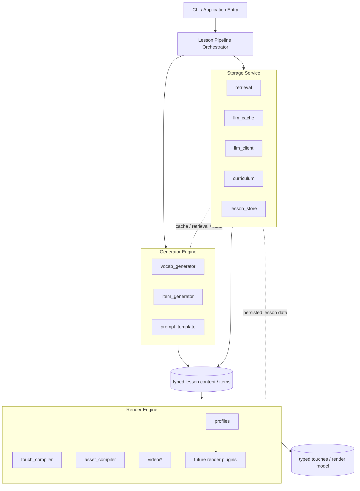

# Decision Preparation: Engine And Service Boundaries

**Status:** Preparation only — no decision yet  
**Date:** 2026-03-21  
**Context:** Internal module dependency analysis and recent pipeline refactoring reduced the
largest dependency loop, but the codebase still shows a module-first structure with several
high-coupling areas. A candidate next architectural step is to reorganize future refactoring
around three higher-level seams: a generator engine, a render engine, and a storage service.

---

## Problem

The current production structure works, but it still leaves several architectural questions open:

1. Which modules together define lesson content generation?
2. Which modules together define rendering/compilation behavior?
3. Which modules own retrieval, persistence, and cache/client boundaries?
4. Should pipeline assembly stay module-first, or become engine/service-first?

Recent dependency analysis suggests that the system is stabilizing around a few clusters, but
the long-term ownership model is still implicit rather than documented.

This document prepares that decision. It does not make it.

---

## Candidate Concept

### Concept sketch

Diagram intent:

- show the candidate separation of concerns only
- highlight a possible intermediate content model between generation and rendering
- show render plugins as a future possibility, not a committed design

Diagram limits:

- this is not a module dependency graph
- this is not a committed implementation plan
- current production orchestration is still module-first

### Candidate 1 — Generator engine

Purpose:
- produce configured content-generation pipeline steps for a lesson run

Likely scope:
- `jlesson/item_generator.py`
- `jlesson/vocab_generator.py`
- `jlesson/prompt_template.py`

Possible responsibilities:
- vocab-source preparation
- item conversion / language-specific shaping
- prompt strategy selection
- generation-step composition for vocabulary, grammar, and practice content

### Candidate 2 — Render engine

Purpose:
- produce configured rendering / compilation steps for a selected profile or output mode

Likely scope:
- `jlesson/touch_compiler.py`
- `jlesson/asset_compiler.py`
- `jlesson/profiles.py`
- `jlesson/video/`

Possible responsibilities:
- touch compilation
- asset manifest planning
- card/audio/video rendering
- plugin-style output strategies

### Candidate 3 — Storage service

Purpose:
- hide retrieval, persistence, and cache/client boundaries behind a smaller service surface

Likely scope:
- `jlesson/retrieval.py`
- `jlesson/llm_cache.py`
- `jlesson/llm_client.py`
- `jlesson/curriculum.py`
- `jlesson/lesson_store.py`

Possible responsibilities:
- retrieval and lookup
- durable content persistence
- curriculum state access
- LLM request caching / client invocation

---

## Why This Concept Is Attractive

### 1. Stronger top-level composition model

The current system already behaves like a composition of generation, compilation/rendering,
and storage/retrieval concerns. Naming those seams explicitly could make the architecture easier
to reason about.

### 2. Better plugin opportunities on the render side

The render path is the clearest candidate for a plugin architecture because profiles and output
formats already vary independently from content generation.

### 3. Less pressure on orchestration modules

Recent refactors reduced coupling in `lesson_pipeline`, but orchestration is still the place
where many concerns meet. Narrower engines/services could reduce that dependency pressure.

### 4. Cleaner future multilingual extension

Language-specific generation behavior and output/rendering behavior are likely to evolve at
different rates. Explicit seams could help keep those changes isolated.

---

## Concerns And Risks

### 1. `Engine` is not automatically a clean boundary

Calling something an engine does not make it cohesive. Each engine must have a narrow contract,
or it will become a larger version of the current coupling problem.

### 2. `Storage service` may be too broad

`curriculum`, `retrieval`, `lesson_store`, `llm_cache`, and `llm_client` do not all serve the
same kind of persistence or access pattern. Grouping them too early may hide important differences:

- curriculum progression/state
- lesson content persistence
- retrieval store/query logic
- LLM transport/client logic
- response cache behavior

### 3. Render plugins need a stable intermediate representation

A plugin architecture for rendering is only useful if the render engine consumes a stable model.
Without that, plugins will need to know too much about upstream lesson internals.

### 4. Generator engine may mix strategy and execution

`item_generator`, `vocab_generator`, and `prompt_template` are related, but they are not all the
same kind of component. One risk is to bundle pure prompt builders with runtime generation flows
without a clear contract between them.

### 5. Additional indirection must justify itself

The project is still a local CLI-oriented system. More abstraction only makes sense if it gives
clear extension value or reduces real maintenance cost.

---

## Open Questions

1. Should engines own step execution, or only produce configured step lists?
2. Should `profiles.py` remain declarative data, or become part of a render-engine runtime layer?
3. Is `llm_client.py` really a storage concern, or should it remain separate infrastructure?
4. Should `curriculum.py` stay domain-owned rather than being folded into a broader storage service?
5. What is the stable intermediate representation between generation and rendering?
6. Is `lesson_store.py` still a durable concept, or should it be folded into a more general persistence boundary?
7. Does the render side need plugins now, or only a cleaner internal seam first?

---

## Preconditions Before Any Decision

The concept should not be decided until the following are clearer:

1. a stable typed intermediate model between generation and rendering
2. clearer ownership of curriculum vs retrieval vs lesson persistence
3. whether multiple concrete render paths are actually planned soon enough to justify plugins
4. whether language-specific strategy assembly stays in `language_config` or moves into a separate runtime registry

---

## Short-Term Documentation Guidance

Until a decision is made:

- keep the current production architecture as the source of truth
- describe the generator/render/storage split as a candidate only
- use future refactors to test the boundaries incrementally instead of forcing a full redesign
- avoid renaming large parts of the codebase around `engine` terminology prematurely

---

## Likely Next Evaluation Steps

1. Continue internal dependency analysis after each structural refactor.
2. Split `language_config` into pure data vs runtime strategy assembly if that boundary proves useful.
3. Refactor `pipeline_existing_lesson` and related render-path code to see whether a render-engine seam emerges naturally.
4. Reassess whether `lesson_store` remains needed as a standalone concept.
5. Only then decide whether a formal engine/service architecture is justified.

---

## Decision Status

No decision yet.

This document is preparation material for a future decision, not a commitment to adopt the
generator-engine / render-engine / storage-service model.