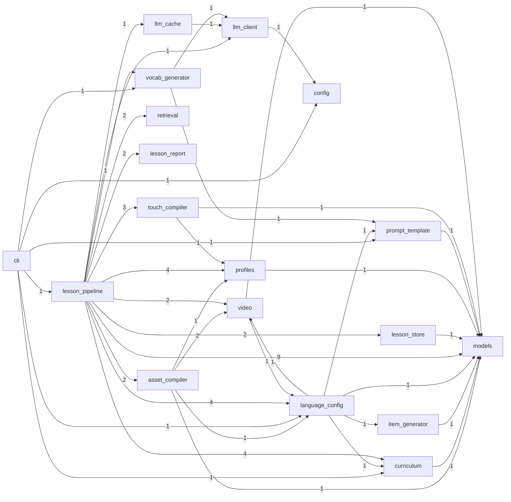

# Internal Module Dependencies: jlesson

- Backend: `grimp`
- Modules: `43`
- Internal edges: `100`
- Cycles: `0`

## Diagram

## Highest Fan-Out

- `jlesson.lesson_pipeline.pipeline_existing_lesson`: `9` [...](../jlesson/lesson_pipeline/pipeline_existing_lesson.py#L1)
- `jlesson.lesson_pipeline.save_report`: `6` [...](../jlesson/lesson_pipeline/save_report.py#L1)
- `jlesson.cli`: `6` [...](../jlesson/cli.py#L1)
- `jlesson.asset_compiler`: `5` [...](../jlesson/asset_compiler.py#L1)
- `jlesson.language_config`: `5` [...](../jlesson/language_config.py#L1)
- `jlesson.lesson_pipeline.persist_content`: `5` [...](../jlesson/lesson_pipeline/persist_content.py#L1)
- `jlesson.lesson_pipeline.compile_assets`: `5` [...](../jlesson/lesson_pipeline/compile_assets.py#L1)
- `jlesson.lesson_pipeline.pipeline_core`: `4` [...](../jlesson/lesson_pipeline/pipeline_core.py#L1)
- `jlesson.lesson_pipeline.generate_sentences`: `4` [...](../jlesson/lesson_pipeline/generate_sentences.py#L1)
- `jlesson.lesson_pipeline`: `4` [...](../jlesson/lesson_pipeline/__init__.py#L1)

## Highest Fan-In

- `jlesson.models`: `18` [...](../jlesson/models.py#L1)
- `jlesson.lesson_pipeline.pipeline_core`: `16` [...](../jlesson/lesson_pipeline/pipeline_core.py#L1)
- `jlesson.language_config`: `7` [...](../jlesson/language_config.py#L1)
- `jlesson.profiles`: `6` [...](../jlesson/profiles.py#L1)
- `jlesson.curriculum`: `6` [...](../jlesson/curriculum.py#L1)
- `jlesson.lesson_pipeline.pipeline_paths`: `5` [...](../jlesson/lesson_pipeline/pipeline_paths.py#L1)
- `jlesson.lesson_pipeline.pipeline_grammar`: `5` [...](../jlesson/lesson_pipeline/pipeline_grammar.py#L1)
- `jlesson.lesson_pipeline.pipeline_llm`: `5` [...](../jlesson/lesson_pipeline/pipeline_llm.py#L1)
- `jlesson.touch_compiler`: `3` [...](../jlesson/touch_compiler.py#L1)
- `jlesson.prompt_template`: `3` [...](../jlesson/prompt_template.py#L1)

## Cross-Group Dependencies

- `asset_compiler` -> `video` (2), `profiles` (1), `models` (1), `language_config` (1)
- `cli` -> `curriculum` (1), `config` (1), `prompt_template` (1), `language_config` (1), `lesson_pipeline` (1), `vocab_generator` (1)
- `curriculum` -> `models` (1)
- `item_generator` -> `models` (1)
- `language_config` -> `video` (1), `curriculum` (1), `prompt_template` (1), `item_generator` (1), `models` (1)
- `lesson_pipeline` -> `models` (9), `language_config` (4), `profiles` (4), `curriculum` (4), `touch_compiler` (3), `retrieval` (2), `lesson_report` (2), `lesson_store` (2), `video` (2), `asset_compiler` (2), `vocab_generator` (1), `llm_client` (1), `llm_cache` (1)
- `lesson_store` -> `models` (1)
- `llm_cache` -> `llm_client` (1)
- `llm_client` -> `config` (1)
- `profiles` -> `models` (1)
- `prompt_template` -> `models` (1)
- `touch_compiler` -> `profiles` (1), `models` (1)
- `video` -> `language_config` (1), `models` (1)
- `vocab_generator` -> `llm_client` (1), `prompt_template` (1)

## Cycles

- None
