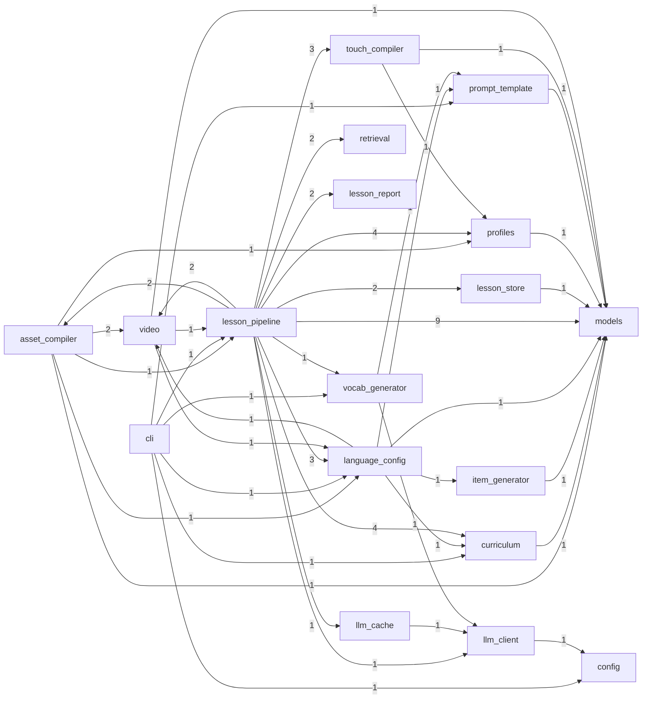

# Internal Module Dependencies: jlesson

- Backend: `grimp`
- Modules: `39`
- Internal edges: `109`
- Cycles: `1`

## Diagram

## Highest Fan-Out

- `jlesson.lesson_pipeline`: `17`
- `jlesson.lesson_pipeline.pipeline_orchestrator`: `9`
- `jlesson.asset_compiler`: `6`
- `jlesson.cli`: `6`
- `jlesson.lesson_pipeline.save_report`: `6`
- `jlesson.lesson_pipeline.pipeline_gadgets`: `5`
- `jlesson.lesson_pipeline.compile_assets`: `5`
- `jlesson.language_config`: `5`
- `jlesson.lesson_pipeline.persist_content`: `4`
- `jlesson.lesson_pipeline.pipeline_core`: `4`

## Highest Fan-In

- `jlesson.models`: `18`
- `jlesson.lesson_pipeline.pipeline_core`: `15`
- `jlesson.lesson_pipeline.pipeline_gadgets`: `13`
- `jlesson.curriculum`: `6`
- `jlesson.language_config`: `6`
- `jlesson.profiles`: `6`
- `jlesson.touch_compiler`: `3`
- `jlesson.llm_client`: `3`
- `jlesson.lesson_pipeline`: `3`
- `jlesson.prompt_template`: `3`

## Cross-Group Dependencies

- `asset_compiler` -> `video` (2), `language_config` (1), `profiles` (1), `lesson_pipeline` (1), `models` (1)
- `cli` -> `language_config` (1), `prompt_template` (1), `curriculum` (1), `lesson_pipeline` (1), `vocab_generator` (1), `config` (1)
- `curriculum` -> `models` (1)
- `item_generator` -> `models` (1)
- `language_config` -> `prompt_template` (1), `item_generator` (1), `video` (1), `curriculum` (1), `models` (1)
- `lesson_pipeline` -> `models` (9), `curriculum` (4), `profiles` (4), `language_config` (3), `touch_compiler` (3), `retrieval` (2), `asset_compiler` (2), `lesson_report` (2), `lesson_store` (2), `video` (2), `llm_client` (1), `llm_cache` (1), `vocab_generator` (1)
- `lesson_store` -> `models` (1)
- `llm_cache` -> `llm_client` (1)
- `llm_client` -> `config` (1)
- `profiles` -> `models` (1)
- `prompt_template` -> `models` (1)
- `touch_compiler` -> `models` (1), `profiles` (1)
- `video` -> `lesson_pipeline` (1), `language_config` (1), `models` (1)
- `vocab_generator` -> `llm_client` (1), `prompt_template` (1)

## Cycles

- `jlesson.asset_compiler -> jlesson.lesson_pipeline -> jlesson.lesson_pipeline.compile_assets -> jlesson.lesson_pipeline.pipeline_orchestrator -> jlesson.video.cards`
