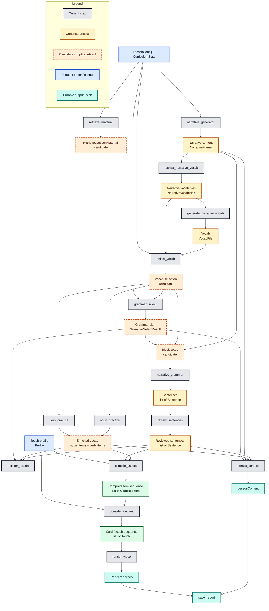

# Lesson Pipeline

The lesson pipeline is still executed as a flat ordered list of `PipelineStep`
instances, but the decomposition work is moving the design toward an
artifact-driven flow where one typed output becomes the next step's input.

This document tracks three things:

1. the canonical classes of pipeline input/output we want to reason about
2. the current step list, purpose, and concrete inputs/outputs
3. the dependency tree between those artifacts and steps

---

## Canonical Artifact Classes

These are the main classes of input/output the pipeline should converge on.
Some already exist as concrete types; others are still implicit and should be
made explicit as more steps migrate.

| Canonical class | Current concrete form | Producer(s) | Consumer(s) | Notes |
|---|---|---|---|---|
| `Block setup` | partly implicit; currently spread across `BlockChunk`, `GrammarSelectResult`, selected vocab slices, and narrative slices | `select_vocab`, `grammar_select`, `narrative_generator` | `narrative_grammar`, future block-aware review/coherence steps | This should become a first-class artifact. It is the missing seam between vocab/grammar selection and sentence generation. |
| `Narrative content` | `NarrativeFrame`, `list[str]` in `LessonContext.narrative_blocks` | `NarrativeGeneratorStep` | `ExtractNarrativeVocabStep`, `SelectVocabStep` gap-fill, `NarrativeGrammarStep` | Already reasonably aligned. |
| `Sentences` | `list[Sentence]`, `SentenceReviewBatch`, `SentenceReviewResult` | `NarrativeGrammarStep`, `ReviewSentencesStep` | `ReviewSentencesStep`, `PersistContentStep`, `CompileAssetsStep` | Already partially aligned: `ReviewSentencesStep` consumes `Sentence` as its batch item type. |
| `Vocab` | `VocabFile`, `list[GeneralItem]`, `noun_items`, `verb_items` | `GenerateNarrativeVocabStep`, `SelectVocabStep`, `NounPracticeStep`, `VerbPracticeStep` | `GrammarSelectStep`, `NarrativeGrammarStep`, persistence/render steps | Still split across raw vocab, selected vocab, and enriched vocab. |
| `Touch profile` | `Profile` from `profiles.py` | config / profile registry | `CompileAssetsStep`, `CompileTouchesStep` | This is a configuration artifact, not a step output. |
| `Card sequences` | currently closest to `list[Touch]`; preceded by `list[CompiledItem]` | `CompileTouchesStep` | `RenderVideoStep` | The repo currently uses `Touch` as the operational sequence type. If we later split sequence planning from runtime/render artifacts, `CardSequence` is a reasonable future name. |

Two additional supporting artifacts matter in the current codebase even though
they are not part of the long-term top-level list above:

| Supporting artifact | Current concrete form | Purpose |
|---|---|---|
| `Retrieved lesson material` | implicit bundle in retrieval result + direct writes into `LessonContext` | Short-circuits multiple generation steps when coverage is high enough. |
| `Persisted lesson content` | `LessonContent` | Durable handoff from generation into later re-render / analysis workflows. |

---

## Composite Step Inputs

An action does not need to depend on exactly one upstream field. When a step
needs more than one input artifact, the aligned pattern is to use a composite
chunk type that still preserves the most important predecessor artifact.

Examples already present in the codebase:

- `GrammarSelectChunk` bundles progression, unlocked grammar, lesson number, and selected vocab context for one lesson-wide call.
- `SentenceReviewBatch` preserves `Sentence` as the core item type, while also carrying nouns, verbs, and grammar context needed by the prompt.
- `BlockChunk` is already a composite block-level setup shape: narrative + nouns + verbs + grammar.

Rule of thumb:

- if a step has a clear predecessor artifact, keep that artifact's type visible in the chunk signature
- add the extra dependencies as fields on the chunk rather than falling back to raw `LessonContext` access inside the action

---

## Runtime Contracts

### `LessonConfig` — immutable top-level run input

Key fields used to assemble artifact flow:

- theme and language selection
- lesson sizing (`lesson_blocks`, vocab counts, grammar counts)
- optional seed narrative
- render profile selection
- retrieval and cache settings

### `LessonContext` — mutable transport during migration

`LessonContext` remains the execution container, but it should be treated as a
transport layer while the pipeline converges on explicit artifacts. The goal is
for more step boundaries to be described in terms of typed chunk/result pairs
rather than ad hoc reads/writes to context fields.

---

## Step Inventory

Default execution order from `lesson_pipeline.__init__`.

| # | Step | Purpose | Current expected inputs | Current outputs | Possible aligned input/output |
|---|---|---|---|---|---|
| 1 | `retrieve_material` | Reuse prior material when retrieval coverage is high enough | theme, retrieval settings, target language, vocab quotas | writes nouns, verbs, noun_items, verb_items, sentences, grammar ids directly to context | `LessonRequest -> RetrievedLessonMaterial` |
| 2 | `narrative_generator` | Generate or normalise block-by-block story progression | theme, lesson number, block count, seed narrative | `NarrativeFrame` -> `narrative_blocks` | Keep as `NarrativeGenChunk -> NarrativeFrame` |
| 3 | `extract_narrative_vocab` | Extract per-block noun/verb hints from the narrative | `NarrativeFrame` | `NarrativeVocabPlan` -> `narrative_vocab_terms` | Keep as `NarrativeFrame -> NarrativeVocabPlan` |
| 4 | `generate_narrative_vocab` | Expand narrative terms into full vocab entries | `NarrativeVocabPlan` | `VocabFile` -> `vocab` | Keep as `NarrativeVocabPlan -> VocabFile` |
| 5 | `select_vocab` | Choose lesson nouns/verbs from vocab with curriculum freshness and narrative fit | `VocabFile`, `NarrativeVocabPlan`, curriculum coverage, optional LLM gap fill | `nouns`, `verbs` as `list[GeneralItem]` | `VocabFile + NarrativeVocabPlan + CurriculumState -> VocabSelection` |
| 6 | `grammar_select` | Choose grammar points and block-level grammar windows | grammar progression, covered grammar ids, nouns, verbs, lesson number | `GrammarSelectResult` -> `selected_grammar`, `selected_grammar_blocks` | `VocabSelection + CurriculumState -> GrammarPlan` |
| 7 | `narrative_grammar` | Generate block-aware practice sentences | `BlockChunk` built from narrative, selected vocab, and grammar slices | `list[Sentence]` -> `sentences` | `BlockSetup -> SentenceSequence` |
| 8 | `review_sentences` | Review sentence naturalness and rewrite weak outputs | `SentenceReviewBatch(ItemBatch[Sentence])` plus vocab/grammar context | `SentenceReviewResult` -> revised `sentences` | `SentenceSequence + review context -> ReviewedSentenceSequence` |
| 9 | `noun_practice` | Enrich selected nouns with examples and memory hooks | `NounPracticeBatch(ItemBatch[GeneralItem])`, lesson number | `noun_items` as enriched `list[GeneralItem]` | `VocabSelection[nouns] -> EnrichedVocab[nouns]` |
| 10 | `verb_practice` | Enrich selected verbs with examples and conjugation context | `VerbPracticeBatch(ItemBatch[GeneralItem])`, lesson number | `verb_items` as enriched `list[GeneralItem]` | `VocabSelection[verbs] -> EnrichedVocab[verbs]` |
| 11 | `register_lesson` | Persist curriculum progression and assign lesson id | nouns, verbs, selected grammar, enriched noun items, sentences | updated curriculum, `lesson_id`, `created_at` | `LessonRegistration` derived from reviewed sentences + enriched vocab + grammar plan |
| 12 | `persist_content` | Persist the generated lesson payload | narrative blocks, grammar ids, enriched vocab, reviewed sentences, lesson id | `LessonContent` written to disk, `content_path` | Emit `LessonContent` explicitly before persisting it |
| 13 | `compile_assets` | Render cards and audio assets needed by the selected profile | enriched vocab, reviewed sentences, `Profile` | `compiled_items` | `RenderItemSet + TouchProfile -> CompiledItemSequence` |
| 14 | `compile_touches` | Build the learner-facing repetition sequence | `compiled_items`, `Profile` | `touches` as `list[Touch]` | `CompiledItemSequence + TouchProfile -> TouchSequence` |
| 15 | `render_video` | Assemble final MP4 from the touch sequence | `touches` | `video_path` | `TouchSequence -> RenderedVideo` |
| 16 | `save_report` | Finalise and persist the run report | accumulated `ReportBuilder` state and artifacts | `report_path` | Keep as report sink; not part of the main learning-content artifact chain |

---

## Alignment Review

Current state by artifact class:

- `Narrative content` is the cleanest aligned chain today: `NarrativeGenChunk -> NarrativeFrame -> NarrativeVocabPlan -> VocabFile`.
- `Sentences` now have a real successor alignment: `NarrativeGrammarStep` produces `Sentence`, and `ReviewSentencesStep` consumes `Sentence` via `SentenceReviewBatch`.
- `Vocab` is still the most fragmented area. Raw vocab, selected vocab, and enriched vocab are all real stages, but they are not yet named as separate artifacts.
- `Block setup` is the biggest missing first-class type. It currently exists only as assembly logic inside `BlockChunk` construction.
- Render-side sequencing is semantically split between `Profile`, `CompiledItem`, and `Touch`. That is workable, but the language should be clarified as `touch profile` plus `touch/card sequence`.

Most useful next alignment target:

- make `Block setup` explicit as the successor of vocab + grammar selection and the predecessor of sentence generation

Second most useful target:

- split vocab flow into named artifacts such as `VocabSelection` and `EnrichedVocab`

---

## Dependency Tree

The tree below mixes canonical artifacts with the current concrete step names.
That mix is intentional:

- gray nodes are concrete pipeline steps that exist today
- yellow/green nodes are concrete artifacts or outputs that already exist in code
- dashed orange nodes are candidate artifacts that are not yet first-class types, but are already present conceptually in the flow
- blue nodes are request/config inputs that shape execution but are not produced by the pipeline itself
- teal nodes are final sinks or durable outputs

In this document, "already aligned" means there is a recognisable typed handoff
where one step emits the same artifact the next step consumes. Examples:

- `NarrativeGeneratorStep -> NarrativeFrame -> ExtractNarrativeVocabStep`
- `ExtractNarrativeVocabStep -> NarrativeVocabPlan -> GenerateNarrativeVocabStep`
- `NarrativeGrammarStep -> Sentence -> ReviewSentencesStep` via `SentenceReviewBatch`

"Artifacts are still implicit" means the flow clearly has a seam, but the code
does not yet model it as a first-class type or named runtime contract. In the
diagram those seams are shown as dashed orange candidate nodes, such as
`Block setup`, `Vocab selection`, and `Enriched vocab`.

Reading guide:

- if a step points directly to a concrete artifact node, that boundary is relatively explicit today
- if several nodes converge on a dashed candidate node before the next step, that is a likely missing abstraction
- the left half of the graph is generation and planning, the middle is lesson assembly and persistence, and the right half is render/output flow



---

## Step Subpackage Pattern

Steps with non-trivial configuration and decomposition should prefer a
subpackage layout:

```text
pipeline_steps/
    review_sentences/
        __init__.py
        action.py
        step.py
```

This keeps each step's input chunk types, action logic, and orchestration logic
cohesive and makes inter-step artifact alignment easier to see.

---

## Known Technical Debt

| Area | Status |
|---|---|
| `Block setup` still implicit | High-value next refactor target |
| Vocab flow split across raw / selected / enriched forms | Needs explicit artifact names |
| Retrieval writes directly to multiple context fields | Useful, but architecturally broad |
| Remaining `PipelineStep` classes not yet migrated to `ActionStep` | Migration in progress |
| Runtime-services coverage beyond `call_llm` | Still incomplete |
