# Lesson Pipeline

The lesson pipeline is still executed as a flat ordered list of `PipelineStep`
instances, but the decomposition work is moving the design toward an
artifact-driven flow where one typed output becomes the next step's input.

This document tracks three things:

1. the canonical classes of pipeline input/output we want to reason about
2. the current step list, purpose, and concrete inputs/outputs
3. the dependency tree between those artifacts and steps

---

## Canonical Artifact Classes

These are the main classes of input/output the pipeline should converge on.
Some already exist as concrete types; others are still implicit and should be
made explicit as more steps migrate.

| Canonical class | Current concrete form | Producer(s) | Consumer(s) | Notes |
|---|---|---|---|---|
| `Per-block content plan` | partly implicit; currently spread across `BlockChunk`, `GrammarSelectResult`, selected vocab slices, and narrative slices | `select_vocab`, `grammar_select`, `narrative_generator` | `narrative_grammar`, `vocab_enrichment`, future block-aware review/coherence steps | This should become a first-class artifact. It is the missing seam between vocab/grammar selection and downstream generation/enrichment work. |
| `Narrative content` | `NarrativeFrame`, `list[str]` in `LessonContext.narrative_blocks` | `NarrativeGeneratorStep` | `ExtractNarrativeVocabStep`, `SelectVocabStep` gap-fill, `NarrativeGrammarStep` | Already reasonably aligned. |
| `Sentences` | `list[Sentence]`, `SentenceReviewBatch`, `SentenceReviewResult` | `NarrativeGrammarStep`, `ReviewSentencesStep` | `ReviewSentencesStep`, `persist_content` / canonisation flow | Already partially aligned: `ReviewSentencesStep` consumes `Sentence` as its batch item type. Longer term, rendering should use persisted lesson-content references rather than live sentence payloads. |
| `Vocab` | `VocabFile`, `list[GeneralItem]`, `noun_items`, `verb_items` | `GenerateNarrativeVocabStep`, `SelectVocabStep`, `vocab_enrichment` (currently `NounPracticeStep` + `VerbPracticeStep`) | `GrammarSelectStep`, `NarrativeGrammarStep`, persistence/canonisation flow | Still split across raw vocab, selected vocab, and enriched vocab, but enrichment is best treated as one conceptual stage. Longer term, downstream rendering should resolve persisted references rather than consume live enriched items. |
| `Touch profile` | `Profile` from `profiles.py` | config / profile registry | `CompileAssetsStep`, `CompileTouchesStep` | This is a configuration artifact, not a step output. |
| `Card sequences` | currently closest to `list[Touch]`; preceded by `list[CompiledItem]` | `CompileTouchesStep` | `RenderVideoStep` | The repo currently uses `Touch` as the operational sequence type. If we later split sequence planning from runtime/render artifacts, `CardSequence` is a reasonable future name. |

Two additional supporting artifacts matter in the current codebase even though
they are not part of the long-term top-level list above:

| Supporting artifact | Current concrete form | Purpose |
|---|---|---|
| `Retrieved lesson material` | implicit bundle in retrieval result + direct writes into `LessonContext` | Short-circuits multiple generation steps when coverage is high enough. |
| `Persisted lesson content` | `LessonContent` | Durable lesson manifest for later render / analysis workflows. Target shape: reference-only content that points to canonised database items instead of embedding full item payloads. |
| `Semantic text record` | candidate English-first meaning-aware record, likely stored first in `GeneralItem.metadata` / `Sentence.metadata` | Preserves exact intended meaning for refinement, review, and later translation. |
| `Canonical semantic record` | candidate normalized record used to build `CanonicalLessonNode` later | Durable meaning identity for retrieval, embeddings, and multilingual branch attachment. |
| `Compiled asset record` | candidate persisted record derived from `CompiledItem` | Durable render artifact that should attach to a `LanguageBranch` by default, and only attach directly to a `CanonicalLessonNode` when the asset is language-neutral. |

---

## Meaning-Aware Semantic Layer

For the current use case, generated words and sentences should not be treated as
plain strings once they leave the immediate prompt/response boundary.

The main distinction is:

1. surface text
2. semantic-aware text record used during content refinement
3. canonical semantic record used later to create canonical retrieval nodes and attach other language branches

Initial assumption for the first implementation slice:

- source text is English
- later translations must preserve the exact intended English meaning, not just the raw wording

This matters because short strings are often ambiguous without context.
Examples:

- `bank` can mean financial institution or river edge
- `cold` can describe temperature or personality
- a short sentence like `that's fine` can express approval, resignation, or refusal depending on context

### `Semantic text record` — refinement-time meaning record

This record stays close to the generated item while the pipeline is still
refining content. It should carry enough information that later translation or
review is based on intended meaning rather than on surface text alone.

Suggested minimum fields for an English-first start:

- `language_code` — initially `en`
- `surface_text` — exact generated text
- `normalized_text` — normalized comparison form
- `concept_type` — noun, verb, sentence, phrase
- `canonical_gloss_en` — short, precise English meaning
- `disambiguation_note` — explicit contrast when ambiguity matters
- `context_text` — local narrative or lesson context needed to interpret the string
- `grammar_id` and `grammar_parameters` when the item is sentence-like
- `metadata_tags` — theme, level, lesson block, register, etc.
- `embedding_text` — the payload to embed; usually gloss + context + disambiguation, not the raw string alone

Important rule: the embedding is not the source of truth for meaning. The
semantic text record is the source of truth; the embedding only supports lookup,
dedupe, and nearest-match retrieval.

### `Canonical semantic record` — durable retrieval/branching record

This record is more stable than the refinement-time one. It is the input that
should later produce `CanonicalLessonNode` records in retrieval and become the
anchor for attaching `LanguageBranch` payloads.

Purpose:

- give one durable identity to one intended meaning
- separate canonical meaning from localized wording
- support reuse across lessons and languages
- let branch attachment happen against meaning, not against raw text

Suggested minimum fields:

- `node_id`
- `canonical_text_en` or a canonical English gloss
- `concept_type`
- `meaning_payload` or equivalent structured source payload
- `metadata_tags`
- `embedding_version`
- `source_item_ref` or provenance back to the lesson item that produced it

### Working flow

The intended flow is:

```text
LLM-generated text
    -> Semantic text record
    -> refined/final lesson item
    -> persist_content handoff
    -> Canonical semantic record
    -> CanonicalLessonNode
    -> LanguageBranch attachments later
    -> reference-only LessonContent
```

This means `persist_content` is not only a file-write step. In the target
architecture it is the boundary where finalized lesson items are handed to:

- canonisation
- language-specific branch attachment when needed
- lesson-content manifest creation using stable database references

### Implementation notes

- generate semantic text records only after the text is stable enough
- for sentences, the best first hook is after `review_sentences`
- for vocab, the best first hook is after `vocab_enrichment` (currently `noun_practice` + `verb_practice`) or after final selection if enrichment is not required
- use embeddings over the semantic payload, not over raw surface text alone
- keep the first slice lightweight by storing semantic text records in item `metadata` before promoting them to first-class models
- build canonical semantic records from final reviewed/enriched items, not from intermediate drafts
- treat `LessonContent` as a reference manifest in the target design, not as the long-term home of full generated item payloads
- make downstream render steps start from persisted lesson content, not from live in-memory generation artifacts
- persist compiled assets as first-class records rather than treating `CompiledItem` as a purely transient render structure
- attach compiled assets to `LanguageBranch` by default, because most cards/audio/text renders are language-specific; only attach directly to `CanonicalLessonNode` when the asset is genuinely language-neutral

---

## Composite Step Inputs

An action does not need to depend on exactly one upstream field. When a step
needs more than one input artifact, the aligned pattern is to use a composite
chunk type that still preserves the most important predecessor artifact.

Examples already present in the codebase:

- `GrammarSelectChunk` bundles progression, unlocked grammar, lesson number, and selected vocab context for one lesson-wide call.
- `SentenceReviewBatch` preserves `Sentence` as the core item type, while also carrying nouns, verbs, and grammar context needed by the prompt.
- `BlockChunk` is already a composite block-level setup shape: narrative + nouns + verbs + grammar.

Rule of thumb:

- if a step has a clear predecessor artifact, keep that artifact's type visible in the chunk signature
- add the extra dependencies as fields on the chunk rather than falling back to raw `LessonContext` access inside the action

---

## Runtime Contracts

### `LessonConfig` — immutable top-level run input

Key fields used to assemble artifact flow:

- theme and language selection
- lesson sizing (`lesson_blocks`, vocab counts, grammar counts)
- optional seed narrative
- render profile selection
- retrieval and cache settings

### `LessonContext` — mutable transport during migration

`LessonContext` remains the execution container, but it should be treated as a
transport layer while the pipeline converges on explicit artifacts. The goal is
for more step boundaries to be described in terms of typed chunk/result pairs
rather than ad hoc reads/writes to context fields.

---

## Step Inventory

Default execution order from `lesson_pipeline.__init__`.

The current production pipeline has 16 steps. `GrammarSelectStep` still exists
as a compatibility path in code, but the default production flow now uses
`canonical_vocab_select` followed by `lesson_planner`.

The pipeline currently has two concrete enrichment steps, `noun_practice` and
`verb_practice`, but architecturally they are better understood as one
conceptual `vocab_enrichment` stage with two item-specific implementations.

| # | Step | Purpose | Current expected inputs | Current outputs | Possible aligned input/output |
|---|---|---|---|---|---|
| 1 | `retrieve_material` | Reuse prior material when retrieval coverage is high enough | theme, retrieval settings, target language, vocab quotas | writes nouns, verbs, noun_items, verb_items, sentences, grammar ids directly to context | `LessonRequest -> RetrievedLessonMaterial` |
| 2 | `narrative_generator` | Generate or normalise block-by-block story progression | theme, lesson number, block count, seed narrative | `NarrativeFrame` -> `narrative_blocks` | Keep as `NarrativeGenChunk -> NarrativeFrame` |
| 3 | `extract_narrative_vocab` | Extract per-block noun/verb hints from the narrative | `NarrativeFrame` | `NarrativeVocabPlan` -> `narrative_vocab_terms` | Keep as `NarrativeFrame -> NarrativeVocabPlan` |
| 4 | `canonical_vocab_select` | Deterministically choose canonical English lesson vocab for planning | `NarrativeVocabPlan`, curriculum coverage, narrative blocks | `CanonicalVocabSelection` -> `canonical_vocab` | Keep as `NarrativeVocabPlan + CurriculumState -> CanonicalVocabSelection` |
| 5 | `generate_narrative_vocab` | Expand canonical narrative terms into language-pair vocab rows | `NarrativeVocabPlan` | `VocabFile` -> `vocab` | In the target design this should move after planning/content finalisation or become a branch-materialisation step |
| 6 | `select_vocab` | Resolve selected canonical terms to language-pair vocab items | `VocabFile`, `CanonicalVocabSelection`, curriculum coverage, optional LLM gap fill | `SelectedVocabSet` -> `nouns`, `verbs` as `list[GeneralItem]` | `CanonicalVocabSelection + BranchVocab -> SelectedVocabSet`; current step materialises source/target too early |
| 7 | `lesson_planner` | Plan grammar selection and per-block pacing in canonical language | `CanonicalVocabSelection`, grammar progression, narrative blocks, curriculum state | `LessonOutline`, `CanonicalLessonPlan`, `selected_grammar`, `selected_grammar_blocks` | `CanonicalVocabSelection + CurriculumState -> CanonicalLessonPlan` |
| 8 | `narrative_grammar` | Generate block-aware practice sentences | `BlockChunk` built from narrative, selected vocab, and grammar slices | `list[Sentence]` -> `sentences` | `PerBlockContentPlan -> SentenceSequence`; this is the first step that should need source/target language sentence content |
| 9 | `review_sentences` | Review sentence naturalness and rewrite weak outputs | `SentenceReviewBatch(ItemBatch[Sentence])` plus vocab/grammar context | `SentenceReviewResult` -> revised `sentences` | `SentenceSequence + review context -> ReviewedSentenceSequence + SemanticTextRecord[sentences]` |
| 10 | `vocab_enrichment` | Enrich selected vocab with examples, conjugation/memory support, and semantic records | selected noun/verb items, lesson number, per-block narrative/grammar context when needed | enriched vocab (`noun_items`, `verb_items`) | `PerBlockContentPlan -> EnrichedVocab + SemanticTextRecord[words]`; this is the second step that should need source/target language content |
| 11 | `register_lesson` | Persist curriculum progression and assign lesson id | nouns, verbs, selected grammar, enriched noun items, sentences | updated curriculum, `lesson_id`, `created_at` | `LessonRegistration` derived from reviewed sentences + enriched vocab + grammar plan |
| 12 | `persist_content` | Canonise finalized lesson items, attach language branches as needed, and persist the lesson manifest | narrative blocks, grammar ids, enriched vocab, reviewed sentences, lesson id | reference-oriented `LessonContent`, `content_path`, canonisation handoff | `Reviewed content + semantic records -> CanonicalSemanticRecord batch -> CanonicalLessonNode/LanguageBranch + LessonContentRefs` |
| 13 | `compile_assets` | Resolve lesson-content references, render cards/audio, persist compiled asset records, and attach them to branch/canonical entities | `LessonContent`, `Profile` | `compiled_items`, compiled asset refs | `LessonContentRefs + TouchProfile -> CompiledItemSequence + CompiledAssetRecord batch + BranchAssetLinks` |
| 14 | `compile_touches` | Build the learner-facing repetition sequence | compiled asset refs and/or `compiled_items`, `Profile` | `touches` as `list[Touch]` | `CompiledAssetRecord batch + TouchProfile -> TouchSequence` |
| 15 | `render_video` | Assemble final MP4 from the touch sequence | `touches` | `video_path` | `TouchSequence -> RenderedVideo` |
| 16 | `save_report` | Finalise and persist the run report | accumulated `ReportBuilder` state and artifacts | `report_path` | Keep as report sink; not part of the main learning-content artifact chain |

Current implementation note for step 9:

- `noun_practice` enriches noun items in batches
- `verb_practice` enriches verb items in batches
- both can be viewed as one `vocab_enrichment` capability with type-specific prompt/action logic

---

## Alignment Review

Current state by artifact class:

- `Narrative content` and canonical term extraction now have a clean early chain: `NarrativeGenChunk -> NarrativeFrame -> NarrativeVocabPlan -> CanonicalVocabSelection`.
- The canonical planning boundary is only partially achieved. `LessonPlannerStep` plans against `CanonicalVocabSelection`, but `generate_narrative_vocab` and `select_vocab` still materialise language-pair vocab before `narrative_grammar`, `review_sentences`, and `vocab_enrichment`.
- `Sentences` now have a real successor alignment: `NarrativeGrammarStep` produces `Sentence`, and `ReviewSentencesStep` consumes `Sentence` via `SentenceReviewBatch`.
- `Vocab` is still the most fragmented area. Raw vocab, canonical selection, selected branch vocab, and enriched vocab are all real stages, but they are not yet named or connected cleanly enough. Treating `noun_practice` and `verb_practice` as one conceptual `vocab_enrichment` stage is a better model.
- `SelectedVocabSet` loses the per-block assignment encoded in `CanonicalVocabSelection`. `NarrativeGrammarStep` rebuilds block groupings by chunking flat noun/verb lists rather than consuming one explicit predecessor artifact that already carries the block plan.
- Meaning-aware refinement is not yet explicit. The code has a place to carry semantic payload (`metadata` on lesson items), but there is not yet a first-class semantic text record or canonical semantic record.
- `LessonContent` is still best thought of as a future reference manifest, not as a durable duplicate of the full generated payload. The target boundary is: finalize items, canonise them, then persist only stable references plus lesson structure.
- `Per-block content plan` is the biggest missing first-class type. It currently exists only as assembly logic inside `BlockChunk` construction and adjacent block-slicing logic.
- Render-side sequencing is semantically split between `Profile`, `CompiledItem`, and `Touch`. That is workable, but rendering should start from `LessonContent` references rather than directly from live enriched items.
- Compiled assets should become durable records linked back into the semantic graph. Default attachment should be at `LanguageBranch`; direct canonical-node attachment should be reserved for language-neutral assets.
- Step artifact persistence still begins only after `register_lesson`, because `steps/<step_name>/` is derived from `lesson_id`. That means the most important planning steps are not currently inspectable in the emitted lesson bundle.
- Step `input.json` snapshots are currently captured after the step action has run. For mutable payloads such as `compile_assets`, this means the recorded input may already contain output-era mutations like asset paths, so those snapshots are not yet trustworthy as true pre-action inputs.

Most useful next alignment target:

- make `Per-block content plan` explicit as the successor of vocab + grammar selection and the predecessor of both sentence generation and vocab enrichment

Second most useful target:

- split vocab flow into named artifacts such as `VocabSelection` and `EnrichedVocab`

Related simplification:

- treat `noun_practice` and `verb_practice` as one `vocab_enrichment` stage in architecture docs, even if code remains split into two implementations for now

Third useful target:

- introduce a first-class semantic text record and a canonical semantic record so translation and retrieval depend on intended meaning rather than on raw text alone

Fourth useful target:

- make `persist_content` the real handoff into canonisation and branch attachment, and reduce `LessonContent` to a reference-only lesson manifest

---

## Observed Totoro Run

Representative review run executed on 2026-04-04:

- theme: `totoro`
- blocks: `5`
- grammar points per lesson: `3`
- grammar points per block: `2`
- nouns per block: `1`
- verbs per block: `1`
- retrieval: disabled
- output root: `output/review_totoro/`

Observed planning results:

- canonical nouns selected: `old house`, `soot sprite`, `dusty house`, `garden`, `camphor tree`
- canonical verbs selected: `move`, `discover`, `clean`, `follow`, `sleep`
- grammar selected: `identity_present_affirmative`, `action_present_affirmative`, `action_present_negative`
- block grammar plan:
    - block 1: `identity_present_affirmative`, `action_present_affirmative`
    - block 2: `identity_present_affirmative`, `action_present_affirmative`
    - block 3: `action_present_affirmative`, `action_present_negative`
    - block 4: `action_present_negative`, `identity_present_affirmative`
    - block 5: `action_present_affirmative`, `action_present_negative`

Observed content-generation results:

- `narrative_grammar` produced `10` sentences
- `review_sentences` revised `1` sentence
- `vocab_enrichment` produced `5` noun items and `5` verb items

Observed artifact persistence results:

- lesson bundle created at `output/review_totoro/eng-jap/totoro/lesson_001/`
- all pipeline steps now persist under the same lesson bundle from the start of the run
- saved `steps/` subfolders now include the planning/content-generation half: `retrieve_material`, `narrative_generator`, `extract_narrative_vocab`, `canonical_vocab_select`, `generate_narrative_vocab`, `select_vocab`, `lesson_planner`, `narrative_grammar`, `review_sentences`, `vocab_enhancement`, plus the later persistence/render steps
- `compile_assets/input.json` is now a true pre-action snapshot and no longer contains rendered asset paths

Observed problems relevant to the canonical-language goal:

- the pipeline already plans grammar in canonical English, but branch language vocab is still generated in step 5 and materialised in step 6 before the final content steps
- persisted enriched items in `content.json` currently have empty `canonical` payloads, so canonical meaning does not survive through enrichment and persistence yet
- `narrative_grammar/input.json` and `review_sentences/input.json` make the remaining gap visible: they still consume language-specific `GeneralItem` / `Sentence` payloads rather than one canonical first-class `PerBlockContentPlan`
- the representative rerun now completes end-to-end, including `lesson.mp4` and `report.md`, so the lesson bundle is a stable review artifact

---

## Refinement Session Prep

Recommended session goal:

- make the planning half fully canonical-language only, and make each step consume one typed predecessor artifact directly

Concrete decisions to make in the session:

1. Should `generate_narrative_vocab` stay in the planning half at all, or should branch-vocab materialisation move to the post-plan content phase?
2. What should the first-class `PerBlockContentPlan` contain so that both `narrative_grammar` and `vocab_enrichment` can consume the same artifact directly?
3. Should `select_vocab` disappear into a later branch-materialisation step built from `CanonicalLessonPlan`, or should it emit a new artifact that preserves per-block mapping instead of flattening it?
4. Where should canonical semantic data be made durable first: `GeneralItem.canonical`, `metadata`, or a new explicit semantic record model?
5. Now that all steps persist into the single lesson folder from the beginning of the run, what additional step-level data is still worth writing for refinement review?
6. Should output snapshots stay at the action-artifact level, or should some steps also persist a second post-merge context view when merge logic adds meaningful fields?

Suggested implementation order:

1. Introduce a first-class `PerBlockContentPlan` built from `CanonicalLessonPlan`.
2. Make `narrative_grammar` consume `PerBlockContentPlan` directly.
3. Make `vocab_enrichment` consume the same `PerBlockContentPlan` directly.
4. Move branch-language vocab resolution so it happens only where source/target language payload is actually needed.
5. Preserve canonical semantic payload through enrichment and `persist_content`.
6. Preserve canonical semantic payload through enrichment and `persist_content` before widening the persisted artifact schema further.

---

## Dependency Tree

The tree below mixes canonical artifacts with the current concrete step names.
That mix is intentional:

- gray nodes are concrete pipeline steps that exist today
- yellow/green nodes are concrete artifacts or outputs that already exist in code
- dashed orange nodes are candidate artifacts that are not yet first-class types, but are already present conceptually in the flow
- blue nodes are request/config inputs that shape execution but are not produced by the pipeline itself
- teal nodes are final sinks or durable outputs

In this document, "already aligned" means there is a recognisable typed handoff
where one step emits the same artifact the next step consumes. Examples:

- `NarrativeGeneratorStep -> NarrativeFrame -> ExtractNarrativeVocabStep`
- `ExtractNarrativeVocabStep -> NarrativeVocabPlan -> GenerateNarrativeVocabStep`
- `NarrativeGrammarStep -> Sentence -> ReviewSentencesStep` via `SentenceReviewBatch`

"Artifacts are still implicit" means the flow clearly has a seam, but the code
does not yet model it as a first-class type or named runtime contract. In the
diagram those seams are shown as dashed orange candidate nodes, such as
`Per-block content plan`, `Vocab selection`, `Enriched vocab`, `Semantic text record`,
and `Canonical semantic record`.

Reading guide:

- if a step points directly to a concrete artifact node, that boundary is relatively explicit today
- if several nodes converge on a dashed candidate node before the next step, that is a likely missing abstraction
- the left half of the graph is generation and planning, the middle is lesson assembly and persistence, and the right half is render/output flow
- the lower side branch shows the intended future path from refined lesson text into canonisation, canonical retrieval nodes, later multilingual branches, a reference-only lesson manifest, and persisted compiled assets used by rendering

```mermaid
flowchart TD
    Request["LessonConfig + CurriculumState"]
    Retrieval[retrieve_material]
    Retrieved["RetrievedLessonMaterial candidate"]

    NarrativeGen[narrative_generator]
    NarrativeFrame["Narrative content<br/>NarrativeFrame"]
    ExtractVocab[extract_narrative_vocab]
    NarrativePlan["Narrative vocab plan<br/>NarrativeVocabPlan"]
    CanonicalSelect[canonical_vocab_select]
    CanonicalVocab["Canonical vocab<br/>CanonicalVocabSelection"]
    GenVocab[generate_narrative_vocab]
    VocabFile["Vocab<br/>VocabFile"]
    SelectVocab[select_vocab]
    VocabSelection["Vocab selection<br/>candidate"]
    LessonPlanner[lesson_planner]
    CanonicalPlan["Canonical lesson plan<br/>CanonicalLessonPlan"]
    BlockPlan["Per-block content plan<br/>candidate"]
    SentenceGen[narrative_grammar]
    Sentences["Sentences<br/>list of Sentence"]
    Review[review_sentences]
    ReviewedSentences["Reviewed sentences<br/>list of Sentence"]

    VocabEnrichment["vocab_enrichment<br/>current: noun_practice + verb_practice"]
    EnrichedVocab["Enriched vocab<br/>noun_items + verb_items"]
    SemanticText["Semantic text record<br/>candidate"]
    CanonicalNode["Canonical lesson node<br/>retrieval"]
    LanguageBranches["Language branches<br/>later"]
    DatabaseStorePut["Store items<br>put"]
    VectorStorePut["Retrival items<br>put"]
    BlobStorePut["Blob items<br>put"]
    DatabaseStoreGet["Store items<br>get"]
    VectorStoreGet["Retrival items<br>get"]
    BlobStoreGet["Blob items<br>get"]

    Register[register_lesson]
    Persist[persist_content]
    LessonContent["LessonContent<br/>reference-only manifest"]

    Profile["Touch profile<br/>Profile"]
    CompileAssets[compile_assets]
    CompiledAssetRecord["Compiled asset record<br/>candidate"]
    CompiledItems["Compiled item sequence<br/>list of CompiledItem"]
    CompileTouches[compile_touches]
    Touches["Card / touch sequence<br/>list of Touch"]
    RenderVideo[render_video]
    Video["Rendered video"]
    SaveReport[save_report]

    subgraph Legend[Legend]
        LegendStep["Current step"]
        LegendArtifact["Concrete artifact"]
        LegendCandidate["Candidate / implicit artifact"]
        LegendRequest["Request or config input"]
        LegendSink["Durable output / sink"]
        LegendRuntime["Runtime services"]
    end

    Request --> Retrieval
    Retrieval --> Retrieved

    Request --> NarrativeGen
    NarrativeGen --> NarrativeFrame
    NarrativeFrame --> ExtractVocab
    ExtractVocab --> NarrativePlan
    NarrativePlan --> CanonicalSelect
    CanonicalSelect --> CanonicalVocab
    NarrativePlan --> GenVocab
    GenVocab --> VocabFile

    VocabFile --> SelectVocab
    CanonicalVocab --> SelectVocab
    Request --> SelectVocab
    SelectVocab --> VocabSelection

    CanonicalVocab --> LessonPlanner
    Request --> LessonPlanner
    LessonPlanner --> CanonicalPlan

    NarrativeFrame --> BlockPlan
    VocabSelection --> BlockPlan
    CanonicalPlan --> BlockPlan
    BlockPlan --> SentenceGen
    SentenceGen --> Sentences
    Sentences --> Review
    Review --> ReviewedSentences

    BlockPlan --> VocabEnrichment
    VocabEnrichment --> EnrichedVocab

    ReviewedSentences --> Register
    EnrichedVocab --> Register
    CanonicalPlan --> Register

    ReviewedSentences --> Persist
    EnrichedVocab --> Persist
    NarrativeFrame --> Persist
    CanonicalPlan --> Persist
    Persist --> SemanticText
    SemanticText --> CanonicalNode
    CanonicalNode --> VectorStorePut
    Persist --> LanguageBranches
    LanguageBranches --> DatabaseStorePut
    Persist --> LessonContent

    LessonContent --> CompileAssets
    Profile --> CompileAssets
    VectorStoreGet --> CompileAssets
    DatabaseStoreGet --> CompileAssets

    CompileAssets --> CompiledAssetRecord
    CompileAssets --> CompiledItems

    CompiledAssetRecord --> BlobStorePut
    CompiledItems --> CompileTouches
    Profile --> CompileTouches
    CompileTouches --> Touches
    Touches --> RenderVideo
    RenderVideo --> Video

    LessonContent --> SaveReport
    Video --> SaveReport

    classDef request fill:#dbeafe,stroke:#1d4ed8,stroke-width:2px,color:#0f172a
    classDef step fill:#e5e7eb,stroke:#111827,stroke-width:2px,color:#111827
    classDef artifact fill:#fef3c7,stroke:#b45309,stroke-width:2px,color:#451a03
    classDef candidate fill:#ffedd5,stroke:#c2410c,stroke-width:2px,color:#431407,stroke-dasharray: 6 3
    classDef render fill:#dcfce7,stroke:#166534,stroke-width:2px,color:#052e16
    classDef sink fill:#ccfbf1,stroke:#0f766e,stroke-width:2px,color:#042f2e
    classDef runtime fill:#fbccd5,stroke:#760f0c,stroke-width:2px,color:#2f0407

    class Request,Profile request
    class Retrieval,NarrativeGen,ExtractVocab,CanonicalSelect,GenVocab,SelectVocab,LessonPlanner,SentenceGen,Review,VocabEnrichment,Register,Persist,CompileAssets,CompileTouches,RenderVideo,SaveReport step
    class NarrativeFrame,NarrativePlan,CanonicalVocab,VocabFile,CanonicalPlan,Sentences,ReviewedSentences,LessonContent,CompiledItems,Touches,Video,CanonicalNode,LanguageBranches artifact
    class Retrieved,VocabSelection,BlockPlan,EnrichedVocab,SemanticText,CanonicalSemantic,CompiledAssetRecord candidate
    class CompiledItems,Touches,Video render
    class VectorStorePut,DatabaseStorePut,BlobStorePut runtime
    class LessonContent,Video,SaveReport sink
    class LegendStep step
    class LegendArtifact artifact
    class LegendCandidate candidate
    class LegendRequest request
    class LegendSink sink
    class LegendRuntime runtime
```



---

## Step Subpackage Pattern

Steps with non-trivial configuration and decomposition should prefer a
subpackage layout:

```text
pipeline_steps/
    review_sentences/
        __init__.py
        action.py
        step.py
```

This keeps each step's input chunk types, action logic, and orchestration logic
cohesive and makes inter-step artifact alignment easier to see.

---

## Known Technical Debt

| Area | Status |
|---|---|
| `Per-block content plan` still implicit | High-value next refactor target |
| Vocab flow split across raw / selected / enriched forms | Needs explicit artifact names |
| Semantic text record / canonical semantic record not yet explicit | Needed for meaning-accurate translation and multilingual branching |
| `LessonContent` still stores full item payloads in current implementation | Target should be reference-only after canonisation |
| `compile_assets` still starts from live enriched items in current implementation | Target should start from persisted lesson content references |
| Compiled assets are not yet first-class persisted records linked to `LanguageBranch` / `CanonicalLessonNode` | Needed so rendering artifacts participate in the same durable semantic graph |
| Retrieval writes directly to multiple context fields | Useful, but architecturally broad |
| Canonical payload is not surviving through enrichment into persisted lesson content | Blocks the intended canonical-trunk plus language-branch model |
| Remaining `PipelineStep` classes not yet migrated to `ActionStep` | Migration in progress |
| Runtime-services coverage beyond `call_llm` | Still incomplete |
